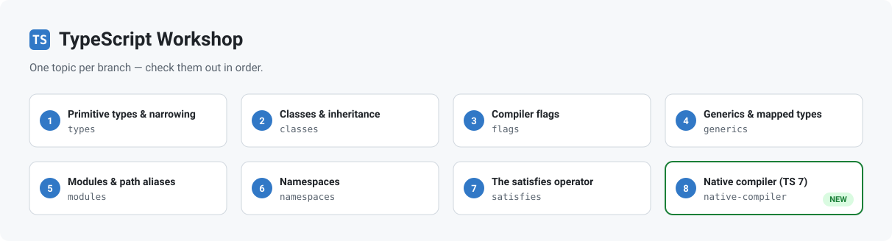

<picture>
  <source media="(prefers-color-scheme: dark)" srcset="assets/workshop-banner-dark.svg">
  
</picture>

## TypeScript Workshop

Each topic lives on its own branch. Check them out in order:

| #   | Topic                                                                   | Branch            |
| --- | ----------------------------------------------------------------------- | ----------------- |
| 1   | Primitive types, type aliases, interfaces, functions, unions, narrowing | `types`           |
| 2   | Classes: access modifiers, inheritance, abstract, implements, patterns  | `classes`         |
| 3   | Compiler flags: strict mode, strictNullChecks, noImplicitAny            | `flags`           |
| 4   | Generics, mapped types, conditional types                               | `generics`        |
| 5   | Modules, imports/exports, path aliases                                  | `modules`         |
| 6   | Namespaces                                                              | `namespaces`      |
| 7   | The `satisfies` operator                                                | `satisfies`       |
| 8   | TypeScript 7: the native compiler and what it changes                   | `native-compiler` |

### TypeScript versions

Branches 1-7 pin **TypeScript 6**. They cannot move to 7 yet: `typescript-eslint`
still declares `peer typescript ">=4.8.4 <6.1.0"` (at 8.68.0), so an upgrade
would break `npm run lint`.

`native-compiler` pins **TypeScript 7** and ships without eslint, which is what
lets it run the real compiler. The type system is identical across both - what
changed in 7 is the configuration surface, and that branch is the tour of it.
